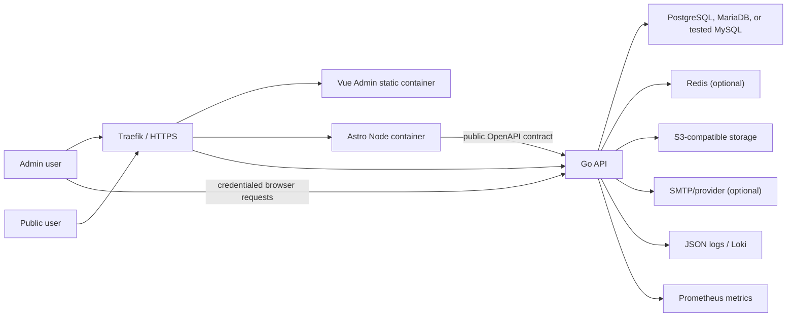
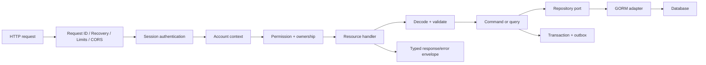

# `go-lang-starter` Design Specification

- สถานะ: อนุมัติ design specification แล้ว
- วันที่: 2026-07-27
- ขอบเขต: `D:\go-lang-starter` เท่านั้น
- สถานะ implementation: เริ่ม Phase R repository foundation แล้ว
- โครงการที่ไม่แตะในระยะนี้: `D:\go-lang-starter-saas`
- หมายเหตุ: InfraStack deployment contract ถูกทำให้ชัดเจนจากพฤติกรรมจริงของ
  `D:\infra-stack\scripts\deploy.sh`; ไม่เปลี่ยนขอบเขตที่อนุมัติ

## 1. Problem และ Goal

ต้องการ starter suite ที่นำไปเป็นฐานของ CMS/Back Office ส่วนตัวได้จริง และสามารถ fork
จาก release ที่เสถียรไปพัฒนาเป็น SaaS ในภายหลัง โดยไม่ต้องรื้อ authentication,
authorization, localization, API contract, deployment และโครงสร้างข้อมูลใหม่

ชุด starter ประกอบด้วย:

- `api`: Go + Gin
- `admin`: Vue + Vite
- `site`: Astro สำหรับ Landing, Docs และ Public Site

ระบบต้องใช้ PostgreSQL เป็นฐานหลัก รองรับ MariaDB ที่มากับ XAMPP เป็น first-class
อีกหนึ่ง engine และมี Oracle MySQL compatibility profile แยกต่างหาก ระบบเปิด
extension point สำหรับฐานข้อมูลอื่นโดยยังไม่กล่าวอ้างว่ารองรับจนกว่าจะมี driver,
migrations และ integration tests จริง

### 1.1 Success Criteria

- Parent repository pin version ของ `api`, `admin` และ `site` ได้อย่างชัดเจน
- Child repository ทั้งสาม build, test, tag และ rollback แยกกันได้
- PostgreSQL และ MariaDB/XAMPP ผ่าน migration/integration test matrix
- Oracle MySQL จะถูกประกาศว่ารองรับต่อเมื่อ compatibility profile ผ่านจริง
- Admin ใช้ session cookie อย่างปลอดภัยและไม่เก็บ auth token ใน `localStorage`
- Authorization ตรวจด้วย permission จากฐานข้อมูล ไม่มี hardcoded role checks
- Account boundary มีอยู่ตั้งแต่แรก แต่ซ่อนเป็น single-account mode
- System administrator เพิ่ม/แก้ภาษาและคำแปลได้โดยไม่แก้โค้ด
- Admin ไม่มี locale ใน URL; Public Site ใช้ `/{locale}/` ทุกภาษา
- Public content ที่ไม่มีคำแปลจริงตอบ 404 และไม่สร้าง duplicate fallback page
- CMS รองรับ structured blocks, workflow, revisions, preview และ scheduling
- SEO/GEO/AEO metadata และ checks อยู่บนข้อมูลที่มองเห็นจริง ไม่มี ranking guarantee
- Optional modules ปิดได้ด้วย config โดยไม่ลบ schema หรือข้อมูล
- Deploy ผ่านสัญญาเดียวกับ `D:\infra-stack` ได้ โดยมี migration workaround ที่ชัดเจน
- ทุก milestone เป็น vertical slice ที่รันและทดสอบได้ ไม่ใช่ skeleton รายชื่อ feature

### 1.2 Non-goals ของ Personal Starter

- Tenant self-service และ account switching
- Billing, plans, subscriptions, trials และ customer portal
- Usage metering, quota และ entitlement
- SaaS operator impersonation
- Revenue/churn reporting
- Microservices, distributed CQRS หรือ runtime plugin loading
- การกล่าวอ้างว่ารองรับฐานข้อมูลที่ไม่มี CI matrix
- Visual page builder แบบลากวางอิสระ

## 2. Approaches Considered

### 2.1 Product Direction

1. **Personal CMS/Back Office ก่อน แล้ว fork เป็น SaaS — เลือกใช้**
   - วาง account abstraction และ permission model ตั้งแต่แรก
   - ซ่อน tenant UX และยังไม่แบก billing/metering complexity
   - ลดโอกาสที่ starter ส่วนตัวจะเต็มไปด้วย SaaS concerns ที่ไม่ได้ใช้

2. **SaaS ก่อน แล้วตัดกลับเป็น CMS**
   - SaaS foundation ครบเร็วกว่า
   - การตัด billing, tenant onboarding และ entitlements ออกมีโอกาสทิ้ง coupling

3. **Starter เดียวเปิดโหมด Personal/SaaS**
   - ลดจำนวน repository ระยะสั้น
   - เพิ่ม conditional paths, test matrix และ configuration complexity มากเกินจำเป็น

### 2.2 Repository Topology

1. **Parent Git superproject + child Git submodules — เลือกใช้**
   - Parent ทำ orchestration, documentation, compatibility และ suite release
   - Child ทั้งสาม version/deploy ได้อิสระ

2. Monorepo workspace เดียว
   - เปลี่ยน contract แบบ atomic ได้ง่าย
   - ขัดกับความต้องการแยก version และ rollback ของแต่ละ starter

3. แยกสาม repository โดยไม่มี parent
   - แต่ละ repo เป็นอิสระสูง
   - ไม่มีจุด pin compatibility และ suite release ที่ตรวจสอบซ้ำได้

### 2.3 Optional Module Mechanism

1. **Compile-in registry + config activation — เลือกใช้**
   - Type-safe, trace ได้ และ deploy ง่าย
   - การเพิ่ม/ลบโค้ด module ต้อง rebuild image

2. Build profiles
   - Image เล็กลง
   - จำนวน build combinations และ CI matrix โตเร็ว

3. Runtime plugins
   - ยืดหยุ่นที่สุด
   - เพิ่ม ABI/version/security complexity ที่ไม่เหมาะกับ starter ระยะแรก

## 3. System Context



Production network contract:

- Go API: `proxy` + `backend`
- Vue Admin: `proxy`
- Astro Site: `proxy`
- Go API เพิ่ม `monitoring` network เฉพาะ deployment ที่เปิด Prometheus scraping
- PostgreSQL, Redis และ object storage ไม่เปิด public port
- Astro และ Vue ห้ามเชื่อม database โดยตรง
- API และ Astro ติดต่อกันภายใน shared `proxy` network

Production domain contract ใช้ registrable base domain เดียวกัน:

- `example.com`: Astro Public Site
- `admin.example.com`: Vue Admin
- `api.example.com`: Go API

ค่าจริงเปลี่ยนผ่าน environment ได้ แต่ต้องทบทวน cookie/CORS/CSRF threat model ใหม่
หากย้าย Admin และ API ไปอยู่คนละ site

## 4. Repository และ Release Contract

```text
D:\go-lang-starter\
├── api\       # Git submodule: go-api-starter
├── admin\     # Git submodule: vue-vite-admin-starter
└── site\      # Git submodule: astro-site-starter
```

กติกา:

- Child repositories ใช้ SemVer ของตัวเอง
- แต่ละ child สร้าง immutable image และบันทึก digest
- Parent release เช่น `suite-v1.0.0` pin:
  - child commit SHA
  - child semantic version
  - image digest
  - OpenAPI admin/public/site-server artifact versions และ checksums
  - localization catalog schema version/checksum
  - exact InfraStack commit SHA ที่ compatibility tests ใช้
  - database support matrix ที่ผ่านจริง
- Rollback ใช้ release manifest เดิม ไม่ใช้ mutable image tag
- API repository เป็น source of truth ของ OpenAPI
- API CI สร้าง tagged contract artifacts สำหรับ Admin, Public และ Site server-only flows
- Generated Go/TypeScript clients commit อยู่ใน owning child repository และห้ามแก้มือ
- CI regenerate clients แล้วต้องได้ no-diff พร้อม checksum ตรงกับ release manifest
- Parent ไม่มี runtime package และ child ไม่ import runtime source ข้าม repository
- Security/common fixes ระหว่าง Personal กับ SaaS ใช้ tracked cherry-pick จาก release lineage
  ไม่สร้าง shared runtime repository ตั้งแต่แรก

Remote repository URLs, Go module path และ registry namespace เป็น implementation
prerequisites ที่ต้องกำหนดก่อนสร้าง Git submodules แต่ไม่เปลี่ยน architecture นี้

## 5. Module Registry

### 5.1 Module States

- **Compiled/installed**: โค้ดอยู่ใน binary
- **Enabled**: เปิดด้วย config และ dependencies ครบ
- **Disabled**: โค้ดยังอยู่ แต่ไม่ register routes, jobs หรือ Admin navigation
- Core modules ปิดไม่ได้

API manifest ระบุ:

- Module ID และ tier
- Dependencies และ required capabilities
- Permissions
- Routes
- Jobs/schedules
- Migration bundles แยก dialect
- Health contributors

Admin manifest ใช้ Module ID เดียวกันและระบุ:

- Routes
- Navigation
- Required permissions
- Views/components

API เป็น authority ของ enabled modules ผ่าน `/api/v1/system/modules`; Admin
register routes เฉพาะ Module IDs ที่ API ส่งกลับ

### 5.2 Lifecycle

1. อ่าน config และ validate required values
2. สร้าง compile-in registry
3. ตรวจ dependency graph และ cycles
4. Deploy pipeline เรียก `cmd/migrate up-and-reconcile` ด้วย image digest และ config
   ชุดเดียวกับ API ที่กำลังจะ deploy
5. คำสั่งเดียวกันรัน migrations ตาม dependency order แล้ว reconcile module state และ
   permission catalog ใน transaction:
   - compiled + enabled permissions เป็น active
   - compiled + disabled permissions เป็น inactive
   - ไม่ลบ role mappings เดิม
   - บันทึก enabled-module/config checksum และ catalog checksum
6. API startup คำนวณ checksum จาก config แล้วต้องตรงกับ database state โดยไม่ทำ
   production migration เอง
7. Register routes/jobs/health ของ enabled modules
8. หาก dependency, schema หรือ checksum ไม่ตรง ให้ fail startup/readiness แบบชัดเจน

Module activation เปลี่ยนผ่าน deployment config + reconcile command เท่านั้น ไม่มี
runtime toggle endpoint ใน Admin; Back Office แสดงสถานะและ module settings ที่ไม่ใช่
activation control

การปิด module:

- ไม่ rollback schema
- ไม่ลบข้อมูล
- ไม่ register routes/jobs/navigation
- Permission catalog ถูกทำ inactive และ grant ใหม่ไม่ได้
- เปิดใหม่แล้ว role mappings เดิมกลับมาใช้ได้
- Reconcile ปฏิเสธการปิด module ที่ยังมี running/pending jobs จนกว่าจะ drain หรือ
  cancel แบบ explicit พร้อม audit

### 5.3 Module Tiers

| Tier | Modules |
|---|---|
| Core | `identity`, `accounts`, `authorization`, `localization`, `settings`, `audit`, `operations` |
| Default | `dashboard`, `publishing`, `media`, `navigation`, `discoverability`, `notifications` |
| Optional | `api_keys`, `webhooks`, `feature_flags`, `import_export`, `analytics`, `search`, `oidc`, `jwt` |

Redis, S3-compatible storage และ SMTP เป็น infrastructure providers/capabilities
ไม่ใช่ business bounded contexts

## 6. Go API Architecture

### 6.1 Style

- Modular monolith
- แบ่งตาม bounded context
- Gin เป็น HTTP transport
- GORM เป็น persistence adapter
- Goose เป็น migration engine
- OpenAPI-first
- Handlers บาง, business logic อยู่ใน command/query/action
- Repository interface อยู่ใน owning module
- ไม่มี generic `BaseRepository`, `CRUDService` หรือ whole-product controller

### 6.2 Request Flow



กติกา:

- Authorize ก่อนอ่านหรือเขียน protected resource
- Multi-table writes อยู่ใน transaction
- External side effects ใช้ transactional outbox
- Jobs ต้อง idempotent, retryable และมี dead-letter/failed state
- Scheduler ใช้ database/Redis lock เพื่อป้องกันหลาย worker enqueue งานเดียวกัน
- External calls มี timeout, bounded retries และ correlation ID
- List endpoints ใช้ bounded pagination, filters และ stable sort
- API response ห้ามคืน GORM model ตรง

### 6.3 API Contract

- Base path: `/api/v1`
- OpenAPI แยก per bounded context/resource
- `oapi-codegen` สร้าง Go types/server interfaces
- TypeScript clients สร้างจาก tagged Admin, Public และ Site server-only artifacts
- Generated files ห้ามแก้มือ
- Mutation รับ `application/json` ยกเว้น upload flow
- List defaults เป็น page-based pagination และมี maximum page size
- Error contract:

```json
{
  "error": {
    "code": "authorization.permission_denied",
    "message": "Request could not be completed.",
    "fields": {},
    "request_id": "opaque-request-id"
  }
}
```

- Error code มีเสถียรภาพและแปลข้อความได้
- Validation errors ผูกกับ field
- ไม่เปิดเผย stack trace, SQL หรือ internal path

## 7. Database และ Data Integrity

### 7.1 Support Levels

- PostgreSQL: default และ first-class
- MariaDB/XAMPP: first-class เมื่อ migration/integration matrix ผ่าน
- Oracle MySQL: แยก compatibility profile และยังไม่เรียกว่า supported จนกว่า profile ผ่าน
- Database อื่น: extension point เท่านั้น
- SQLite ห้ามใช้แทน PostgreSQL/MariaDB/MySQL แล้วกล่าวอ้าง compatibility

การตรวจ local environment พบว่า executable ที่ XAMPP ติดตั้งระบุ engine เป็น MariaDB
ไม่ใช่ Oracle MySQL จึงห้ามใช้คำว่า “MySQL/XAMPP” เพื่อเหมารวมสอง engine ใน test report

Config รองรับทั้ง field-based connection values และ DSN ที่ encode ถูกต้อง โดย
InfraStack template ใช้ field-based values เพื่อลดปัญหา special characters ใน password

MariaDB/XAMPP:

- Native Go บน Windows: `127.0.0.1:3306`
- Go ใน Docker Desktop: `host.docker.internal:3306`

Configuration ใช้ `DB_DRIVER=postgres|mysql` สำหรับ GORM dialector และใช้
`DB_FLAVOR=mariadb|mysql` เมื่อเลือก MySQL-family เพื่อเลือก migration bundle ที่ถูกต้อง

### 7.2 Schema Conventions

- Tenant-owned rows มี `account_id`
- System-wide catalogs ไม่มี `account_id`
- Foreign keys และ composite indexes รวม `account_id` เมื่อใช้ tenant boundary
- Unique constraints ต้องสะท้อน account scope
- Content ใช้ revision records และ optimistic concurrency
- User/content/media deletion ใช้ soft delete เมื่อจำเป็นต่อ audit/recovery
- Mapping rows ที่สร้างใหม่ได้อย่างปลอดภัยใช้ hard deleteได้เมื่อ transaction/audit ครบ

Conceptual table groups:

- Identity: users, credentials, sessions, MFA, recovery tokens
- Accounts: accounts, memberships
- Authorization: permissions, roles, role permissions, membership roles,
  system role assignments
- Localization: locales, translation overrides, catalog versions
- Operations: settings, audit events, queued/failed jobs, outbox events, module states
- Publishing: pages, posts, categories, tags, translations, revisions, workflow events
- Media: assets, variants, upload sessions
- Navigation: menus, menu items
- Discoverability: redirects, SEO metadata, content audit results
- Notifications: templates, notifications, deliveries
- Optional modules: tables owned by แต่ละ module

### 7.3 Migrations

- แยก PostgreSQL/MariaDB/Oracle MySQL scripts โดยใช้ logical version/basename เดียวกัน
- แต่ละ module มี Goose version table ของตัวเอง
- CI ตรวจ dialect parity, checksum และ `up -> down -> up`
- Production API ห้ามใช้ GORM `AutoMigrate`
- Deploy ใช้ expand -> migrate -> contract
- Drop/rename/type-change ต้องแยก release และมี transition period
- Code rollback ไม่ย้อน schema อัตโนมัติ
- Destructive migration ต้องมี verified backup และ explicit approval
- Migration runner ใช้ database/advisory lock ป้องกัน concurrent deploy

## 8. Authentication และ Security

### 8.1 Session Authentication

- Admin ใช้ opaque server-side session
- Database session store เป็นค่าเริ่มต้น
- Redis session adapter เป็น optional capability
- Production cookie ใช้ชื่อ prefix `__Host-`
- Cookie: host-only, `Path=/`, `HttpOnly`, `Secure`, `SameSite=Lax`
- เก็บ hash ของ session token ใน storage
- Rotate session หลัง login, password/MFA/privilege change
- มี idle timeout และ absolute timeout
- Logout/revoke ลบ server-side session
- ผู้ใช้ดูและ revoke sessions/devices อื่นได้
- Auth/session responses ใช้ `Cache-Control: no-store`

Password ใช้ Argon2id พร้อม policy ที่กำหนดจาก config; reset/recovery tokens และ
MFA recovery codes เป็นค่าใช้ครั้งเดียวและเก็บเป็น hash ส่วน TOTP secret ต้องเข้ารหัส
at rest ด้วย key ที่อยู่นอกฐานข้อมูล และหลังยืนยันการลงทะเบียนแล้วห้ามส่งค่ากลับจาก API

Public self-signup ปิดโดย default; user/membership ใหม่สร้างได้โดย principal ที่มี
permission เท่านั้นและ activation ใช้ one-time hashed token ส่วน self-service signup
ถูกเลื่อนไป SaaS starter

### 8.2 CORS และ CSRF

- Credentialed CORS ใช้ exact origin allowlist แยก environment
- Production อนุญาต Admin origin เท่านั้นโดย default
- ห้าม wildcard หรือ reflect origin โดยไม่ validate
- ส่ง `Vary: Origin`
- ทุก `POST`, `PUT`, `PATCH`, `DELETE` รวม login/logout ต้องมี session-bound CSRF token
- ตรวจ `Origin` และ fallback `Referer`
- Safe methods ห้ามมี business/data mutation
- Invalid/missing CSRF fail closed

Pre-auth flow:

1. `GET /api/v1/auth/csrf` สร้างหรือ rotate anonymous pre-auth session อายุสั้นและ
   คืน CSRF token ใน response body
2. Login ส่ง pre-auth cookie พร้อม `X-CSRF-Token`
3. Credential ถูกแต่ต้องทำ MFA: revoke pre-auth ID แล้วออก limited `mfa_pending`
   session พร้อม CSRF token ใหม่
4. Login สำเร็จหรือ MFA สำเร็จ: revoke session เดิม แล้วออก authenticated session ID
   และ CSRF token ชุดใหม่
5. Session ID ก่อนหน้าทุกตัวใช้ซ้ำไม่ได้

การสร้าง ephemeral pre-auth state โดย safe CSRF endpoint เป็นข้อยกเว้นด้าน security
เท่านั้นและไม่เปลี่ยน business data

### 8.3 Rate Limiting

- General per-instance limiter สำหรับ baseline
- DB-backed auth attempt/lockout เพื่อให้หลาย replica เห็นสถานะเดียวกัน
- Redis distributed limiter เป็น optional high-throughput provider
- เข้มงวดเป็นพิเศษกับ login, recovery, MFA, preview, upload, webhooks และ public forms
- Client key ใช้ remote peer โดย default; เชื่อ forwarded client address เฉพาะเมื่อ
  immediate peer อยู่ใน explicit validated trusted-proxy CIDR allowlist และห้าม trust-all

### 8.4 Content และ Upload Security

- CMS เก็บ structured blocks
- Raw JavaScript และ arbitrary HTML ปิดโดย default
- Rich text sanitize ฝั่ง API
- Upload ตรวจ extension, declared MIME, magic bytes, size และ image dimensions
- Object key สุ่มและไม่ใช้ user filename เป็น path
- Original private by default
- Image re-encode และ strip metadata ตาม policy
- SVG/executable uploads ปิดโดย default
- Malware scanner เป็น optional hook; quarantined file เผยแพร่ไม่ได้
- S3/MinIO/R2 ใช้ short-lived signed URL
- Local filesystem storage ใช้ได้เฉพาะ development; production ที่เปิด Media module
  ต้องกำหนด shared S3-compatible provider
- Delete DB/object ใช้ retry/compensation
- Remote URL import ไม่อยู่ใน default scope; หากเพิ่มต้องมี SSRF controls

### 8.5 Secrets และ Audit

- Commit ได้เฉพาะ dummy `.env.example`
- Required secret ว่างหรือเป็น `CHANGE_ME` ทำให้ startup fail
- Secret แยก project/environment
- Frontend รับเฉพาะ public runtime config
- Phase แรก Back Office แก้ได้เฉพาะ non-secret settings
- Logs ห้ามมี password, cookie, token, signed URL, secret หรือ unnecessary PII
- Audit ครอบคลุม auth, permission, publishing, localization, settings และ module changes
- Audit records เป็น append-only ใน application และเข้าถึงด้วย permission เฉพาะ
- Audit แยก `system`/`account` scope: system initialization ก่อนมี account ใช้ typed
  system actor + operation ID และ nullable `account_id`; HTTP event เพิ่ม request ID

## 9. Authorization Model

Authorization ตรวจ permission ไม่ตรวจ role name

Permission key:

```text
<module>.<resource>.<action>.<scope>
```

ตัวอย่าง:

- `publishing.pages.read.any`
- `publishing.pages.update.own`
- `authorization.roles.assign.any`
- `localization.translations.update.system`

กติกา:

- Default deny
- User ได้ permissions ผ่าน roles เท่านั้น
- ไม่มี direct user grant/deny
- User มีหลาย role และ effective permissions เป็น union
- System roles และ account roles เป็น dynamic database records
- Account role จัดการได้เฉพาะ account ของตัวเอง
- System permissions มอบให้ account role ไม่ได้
- ผู้มอบสิทธิ์มอบได้เฉพาะ permission ที่ตนถืออยู่
- Permission ต้องอยู่ account เดียวกันและ `delegable=true`
- API ตรวจ account, ownership และ scope ทุก request
- ป้องกัน last authorization manager
- Permission cache มี version และ invalidation
- Frontend permission checks ใช้เพื่อ UX เท่านั้น
- Bootstrap สร้าง account, user และ dynamic initial role แบบ one-time

Scope `any` หมายถึง resource ใดก็ได้ภายใน account context ที่ resolve แล้ว ไม่ได้แปลว่า
ข้ามทุก account; การข้าม account ต้องใช้ system-only permission ที่ประกาศแยก

Security test matrix ต้องครอบคลุม horizontal/vertical escalation, IDOR,
cross-account access, stale permission cache และ module-disabled permissions

## 10. Localization

### 10.1 Locale Registry

Locale record มี:

- locale code
- native name
- text direction
- enabled
- user selectable
- default
- explicit fallback locale สำหรับ UI catalog

เฉพาะ system principal ที่มี `localization.locales.manage.system` จึงเพิ่ม/แก้/เปิดภาษา
และต้องมี `localization.translations.update.system` จึงแก้คำแปล UI ได้ Permissions
สองรายการนี้เป็น system-only และมอบให้ account roles ไม่ได้ Tenant/user ทั่วไป
เลือกภาษาได้เฉพาะรายการที่ `user_selectable`

### 10.2 Catalog Sources

```text
locales/
└── [locale]/
    ├── common.json
    ├── navigation.json
    ├── auth.json
    ├── validation.json
    ├── cms.json
    └── settings.json
```

- Starter bundle ตัวอย่าง `th` และ `en`; first migrate initialize configured locales
  และ exactly one default แบบ idempotent โดย rerun ไม่ทับค่าที่ system แก้แล้ว
- ภาษาเพิ่มภายหลังอยู่ใน DB catalog/overrides
- Import/export ใช้ schema และ category structure เดียวกับไฟล์
- Merge order: DB override -> bundled locale -> configured UI fallback
- Missing/diff/import/export/reset/audit อยู่ใน Back Office
- รองรับ plural, interpolation, date/time, number, currency และ RTL
- ไฟล์ catalog แยก subcategory เมื่อมีจำนวน keys มากเกินขอบเขตที่อ่านง่าย

UI catalog fallback ใช้ได้ แต่ CMS content translation ไม่มี public fallback page

- Admin และ API ไม่มี locale segment ใน URL
- API ใช้ `Accept-Language` สำหรับ system/error messages
- Content endpoints รับ locale แบบ explicit field/query ตาม contract
- Public Site เท่านั้นที่ใช้ locale segment

## 11. Vue Admin

Stack:

- Vue + Vite + TypeScript
- Vue Router
- TanStack Vue Query สำหรับ server/session state
- Pinia สำหรับ theme, locale, sidebar และ client preferences เท่านั้น
- Tailwind CSS + shadcn-vue open-code components
- OpenAPI-generated TypeScript client

Bootstrap flow:

1. โหลดและ validate `/config.js`
2. สร้าง API client พร้อม `credentials: include`
3. โหลด CSRF/session
4. โหลด enabled module catalog และ effective permissions
5. Register routes/navigation ของ enabled modules
6. Route enabled แต่ไม่มี permission -> 403
7. Route ของ disabled module -> 404

กติกา UX:

- Admin ไม่มี locale segment
- Lists ใช้ server pagination/filter/sort และเก็บ state ใน URL
- ทุก screen มี loading, empty, error, retry, forbidden และ long-content states
- Forms มี labels, inline errors, error summary และ double-submit protection
- Keyboard navigation, visible focus, semantic HTML และ reduced motion
- Responsive ตั้งแต่ mobile ถึง large desktop
- Light/dark/system theme
- Route-level code splitting
- ห้ามเก็บ session/token ใน local storage
- ห้าม import generated client ตรงจาก view/component
- ไม่มี generic CRUD screen ที่เปลี่ยนเพียง schema/label

## 12. Astro Public Site

ใช้ Astro static output เป็น default และติดตั้ง Node adapter เพื่อ opt out เป็น on-demand
เฉพาะ dynamic routes

เนื่องจาก locale registry เพิ่มได้จากฐานข้อมูลขณะ runtime ระบบไม่ใช้ Astro built-in
static locale list เป็น authority แต่ใช้ `[locale]` routes และ custom middleware

Routes:

- `/` -> 302 ไป selected/default locale และต้องเป็น on-demand (`prerender = false`)
- `/{locale}/`
- `/{locale}/{page-slug}`
- `/{locale}/blog/`
- `/{locale}/blog/{slug}`
- `/{locale}/docs/{path}`
- preview exchange และ clean preview URL
- locale sitemaps, RSS, robots และ optional `llms.txt`

Locale behavior:

- Cookie -> `Accept-Language` -> system default
- `enabled` ควบคุม route availability
- `user_selectable` ควบคุม switcher
- Missing locale/content -> 404
- ไม่มี CMS content fallback ข้ามภาษา
- `hreflang` สร้างเฉพาะ translation ที่เผยแพร่จริง

Rendering/cache:

- Prerender เฉพาะ route ที่ไม่อ่าน Cookie, `Accept-Language` หรือ request-time state
- Stable system pages/assets ที่ไม่พึ่ง request state จึง prerender ได้
- CMS pages, posts, docs, feeds และ preview on-demand
- Published content ใช้ ETag, bounded TTL และ invalidation event
- Single instance ใช้ memory cache ได้
- Multi-replica production ใช้ shared cache provider หรือยอมรับ bounded TTL อย่างชัดเจน
- Cache invalidation endpoint ใช้ได้เฉพาะ internal service route, ถูกตัดออกจาก public
  Traefik routing และยังตรวจ HMAC signature, timestamp และ replay
- API failure + cache -> stale content พร้อม degraded logging
- API failure + no cache -> 503
- Preview -> `noindex`, `no-store`, `Referrer-Policy: no-referrer`
- Preview code ออกได้หลัง API ตรวจ permission, มีอายุสั้นและใช้ครั้งเดียวเพื่อแลก
  host-only preview cookie แยกจาก Admin session
- Site ใช้ generated server-only client สำหรับ preview exchange และห้าม bundle client นี้
  ไปยัง browser

### 12.1 Structured Blocks

- Hero
- Rich text
- Image
- Features
- CTA
- FAQ
- Pricing
- Testimonials
- Code
- Comparison
- Direct answer
- Definition
- Steps
- Key facts
- Sources/citations

หนึ่ง block type ต่อหนึ่ง backend schema/validator และหนึ่ง Astro component

## 13. CMS และ Back Office Features

Publishing resources:

- Page
- Post
- Category
- Tag
- Content translation
- Revision
- Workflow event
- Publication schedule

Workflow:

- Draft
- Review
- Scheduled
- Published
- Archived

Capabilities:

- Revision history
- Diff
- Preview
- Rollback
- Schedule publish/unpublish
- Optimistic concurrency
- Media library
- Menus/navigation
- Redirect management
- Notification templates/history
- Jobs/outbox monitor
- Audit log
- System/module health summary

## 14. SEO, GEO และ AEO

SEO:

- Per-locale title/description
- Canonical
- `hreflang` และ `x-default`
- Sitemap index และ locale sitemaps
- Robots
- RSS
- Redirects
- Open Graph/social metadata

Structured data:

- Organization
- WebSite
- BreadcrumbList
- Article เมื่อ visible article data ครบ
- FAQ เมื่อคำถาม/คำตอบแสดงจริง
- Schema อื่นเพิ่มได้เฉพาะเมื่อสอดคล้องกับ visible content

GEO/AEO content signals:

- Direct answer/definition/steps/comparison/key facts blocks
- Author credentials
- Citations/sources
- Published/updated dates
- Content provenance
- Pre-publish checks

ข้อจำกัด:

- ไม่มีการรับประกันอันดับหรือ AI citation
- `llms.txt` เป็น optional
- JSON-LD ห้ามสร้างข้อมูลที่หน้าไม่แสดง
- Draft/preview ต้อง `noindex`

## 15. Deployment และ Operations

### 15.1 Containers

- Multi-stage builds
- Pinned base images; ไม่ใช้ `latest`
- Numeric non-root UID/GID
- Unprivileged internal ports
- No new privileges และ drop capabilities เท่าที่ทำได้
- Read-only root filesystem พร้อม explicit writable tmpfs
- ไม่มี secrets ใน image/build args
- Rolling services ไม่มี `container_name`
- Resource limits
- Healthcheck ที่ไม่พึ่ง shell/curl หาก runtime image ไม่มี

### 15.2 Health และ Observability

- API `/livez`: process only
- API `/readyz`: DB และ enabled critical dependencies ด้วย short timeout
- Admin/Astro `/healthz`
- InfraStack ใช้ `/readyz` เป็น API `HEALTHCHECK_PATH`
- Metrics อยู่ internal route/listener และไม่ expose ผ่าน public Traefik
- JSON logs ไป stdout/stderr
- Fields ขั้นต่ำ: timestamp, level, service, environment, request ID, trace ID,
  route template, status, duration
- หลีกเลี่ยง high-cardinality metric labels
- Uptime Kuma ตรวจ public health
- Prometheus metrics ขั้นต่ำ: requests, errors, latency, DB pool, auth failures,
  rate limit, uploads, jobs และ cache

### 15.3 Deployment Order

1. Lint, tests, security/secret scan
2. Build immutable artifacts/images
3. Verify OpenAPI and generated-client drift
4. Pull images
5. Parent `scripts/deploy-infra-stack.sh` รัน fixed Compose service `api-migrate`
   ด้วย API image digest และ environment ชุดเดียวกับ release
6. `api-migrate` เรียก `migrate up-and-reconcile`, ต่อเฉพาะ `backend` network และ
   propagate non-zero exit code กลับ wrapper
7. Migration/reconcile สำเร็จจึงเรียก InfraStack deploy หลัง wrapper ยืนยันว่า
   target project `.env` ทั้งสามมีค่า exact `DEPLOY_MIGRATE=0`; wrapper ไม่ export
   ค่านี้แทนและไม่แก้ target `.env`
8. หาก migration ล้ม ให้หยุดก่อนแตะ running release
9. Rolling deploy API และตรวจ bounded readiness/checksum/running image digest
10. Deploy Admin แล้วตรวจ bounded `/healthz` และ running image digest
11. Deploy Astro แล้วตรวจ bounded `/healthz` และ running image digest
12. Smoke/E2E critical flows
13. Monitor logs, metrics และ uptime

### 15.4 InfraStack Compatibility

Starter เตรียม templates ภายใต้ parent `ops/infra-stack` แต่ไม่แก้
`D:\infra-stack` อัตโนมัติ

Current contract gaps:

- `deploy.sh` hardcodes `php artisan migrate --force`
- ระยะแรก parent wrapper บังคับใช้ service name `api-migrate`, ตรวจ required env/config
  checksum และบังคับให้ target project `.env` มี `DEPLOY_MIGRATE=0` อยู่ก่อนแล้ว เพราะ
  `deploy.sh` อ่านค่าจากไฟล์ ไม่อ่าน process environment
- Wrapper รับ exact release manifest และชื่อ API/Admin/Site project, ตรวจ canonical
  containment ใต้ `projects/`, ตรวจ exact InfraStack commit + clean tracked worktree +
  pinned `scripts/deploy.sh` bytes/mode จาก manifest และ
  reject source-build mode (`projects/<name>/src/.git`) เพื่อให้ code ที่ migrate กับ
  code ที่ deploy ใช้ image digest ชุดเดียวกัน
- การเพิ่ม generic `MIGRATE_SERVICE` เป็นงาน InfraStack แยก
- ชื่อ database ต้อง sanitize `-` เป็น `_` หรือระบุ explicit DB name
- Production ใช้ per-project DB/object-storage credentials
- Security header middleware ต้อง attach ให้ public routers
- Prometheus ต้องเพิ่ม app target
- InfraStack ปัจจุบันไม่มี MariaDB/Oracle MySQL service หรือ backup pipeline
- MinIO/R2 ต้องมี versioning/replication/backup policy ของตัวเอง

InfraStack production scripts เป็น Bash/Linux workflow; PowerShell wrapper ใช้ได้เฉพาะ
local validation บน Windows ส่วน production wrapper ใช้ CLI contract:
`--infra-stack-dir <absolute> --release-manifest <path> --api-project <name>
--admin-project <name> --site-project <name>` และ fail ก่อน deploy หาก revision,
canonical target, registry-only mode, `.env`, compose หรือ service ไม่ตรง contract

### 15.5 Backup และ Recovery

- Database และ media backup แยกจาก application
- Backup encrypted และใช้ credential แยกจาก app
- กำหนด RPO/RTO ก่อน production
- Restore drill และตรวจ row counts/critical flows
- PostgreSQL, MariaDB/XAMPP และ Oracle MySQL มี runbook/profile แยกตามที่เปิดรองรับ
- Redis loss อาจยอมรับเป็น forced logout แต่ห้ามทำให้ primary data สูญหาย

## 16. Planned File/Module Layout

ส่วนนี้เป็นโครงสร้างที่อนุมัติแล้ว ไม่ใช่ sitemap ของ implementation ปัจจุบัน

### 16.1 Parent

```text
D:\go-lang-starter\
├── .gitmodules
├── api\
├── admin\
├── site\
├── docs\
│   ├── specs\
│   ├── architecture\
│   ├── contracts\
│   └── operations\
├── integration\
│   ├── playwright.config.ts
│   └── tests\
├── ops\
│   ├── local\
│   └── infra-stack\
│       ├── api\
│       ├── admin\
│       └── site\
├── releases\
│   ├── manifest.schema.json
│   └── suite-vX.Y.Z.yaml
├── scripts\
└── .github\workflows\
```

### 16.2 API

```text
api\
├── cmd\
│   ├── api\main.go
│   ├── worker\main.go
│   ├── migrate\main.go
│   └── bootstrap\main.go
├── internal\
│   ├── app\
│   │   ├── api.go
│   │   ├── worker.go
│   │   ├── migrator.go
│   │   ├── dependencies.go
│   │   └── modules.go
│   ├── modular\
│   │   ├── manifest.go
│   │   ├── registry.go
│   │   ├── dependencies.go
│   │   └── state.go
│   ├── platform\
│   │   ├── config\
│   │   ├── database\
│   │   ├── httpserver\
│   │   ├── middleware\
│   │   ├── response\
│   │   ├── validation\
│   │   ├── crypto\
│   │   ├── telemetry\
│   │   └── ratelimit\
│   ├── modules\
│   ├── adapters\
│   │   ├── cache\
│   │   ├── storage\
│   │   ├── mail\
│   │   └── session\
│   └── generated\openapi\
├── openapi\
│   ├── root.yaml
│   ├── modules\[module]\
│   └── dist\
│       ├── admin.openapi.yaml
│       ├── public.openapi.yaml
│       └── site-server.openapi.yaml
├── locales\[locale]\
├── tests\
│   ├── integration\
│   ├── contract\
│   ├── migrations\
│   └── security\
├── Dockerfile
├── compose.dev.yml
├── .env.example
├── .env.postgres.example
├── .env.mariadb-xampp.example
├── .env.mysql.example
└── .github\workflows\
```

Per-module pattern:

```text
internal\modules\[module]\
├── manifest.go
├── permissions.go
├── domain\[resource].go
├── application\[resource]\
│   ├── create.go
│   ├── get.go
│   ├── list.go
│   ├── update.go
│   └── delete.go
├── ports\[resource]_repository.go
├── adapters\gorm\[resource]_repository.go
├── transport\http\[resource]_handler.go
└── migrations\
    ├── postgres\
    ├── mariadb\
    └── mysql\
```

Non-CRUD commands/queries เช่น publish, rollback, grant, revoke, finalize upload,
retry delivery และ preview แยกหนึ่งไฟล์ต่อ use case

### 16.3 Admin

```text
admin\
├── src\
│   ├── main.ts
│   ├── App.vue
│   ├── app\
│   │   ├── bootstrap.ts
│   │   ├── runtime-config.ts
│   │   ├── query-client.ts
│   │   ├── router\
│   │   │   ├── index.ts
│   │   │   ├── core-routes.ts
│   │   │   └── guards\
│   │   ├── modules\
│   │   │   ├── manifest.ts
│   │   │   ├── registry.ts
│   │   │   └── activate.ts
│   │   └── layouts\
│   ├── generated\api\
│   ├── shared\
│   │   ├── api\
│   │   ├── components\
│   │   │   ├── ui\
│   │   │   ├── shell\
│   │   │   ├── data-table\
│   │   │   ├── forms\
│   │   │   └── feedback\
│   │   ├── permissions\
│   │   ├── stores\
│   │   └── utils\
│   ├── modules\
│   ├── locales\[locale]\
│   └── styles\
├── tests\
├── e2e\
├── public\config.template.js
├── docker\
├── Dockerfile
├── components.json
├── openapi-client.config.ts
├── vite.config.ts
└── .github\workflows\
```

Per-module pattern:

```text
src\modules\[module]\
├── manifest.ts
├── routes.ts
├── navigation.ts
├── api\[resource].client.ts
├── queries\[resource].queries.ts
├── mutations\[resource].mutations.ts
├── schemas\[resource].schema.ts
├── views\[screen]View.vue
├── components\[component].vue
└── tests\
```

Admin views:

- Identity: Login, Forgot Password, Reset Password, MFA Challenge, MFA Setup, Profile,
  Sessions
- Accounts: Account Settings, Member List/Create/Detail/Edit
- Authorization: Role List/Create/Detail/Edit, Permission Catalog, Member Roles
- Localization: Locale List/Create/Edit, Translation Catalog/Editor/Missing/Import/Export
- Settings: General, Security Policy, Module Settings
- Audit: Audit Log, Audit Event Detail
- Operations: Module Status, Jobs, Failed Jobs, Outbox, System Health
- Publishing: Page List/Create/Edit, Post List/Create/Edit, Categories, Tags
- Workflow: Review Queue, Schedule, Revision History/Compare
- Media: Library, Detail
- Navigation: Menu List/Edit
- Discoverability: Redirect List/Create/Edit, SEO Defaults, Content Audit
- Notifications: Template List/Edit, History
- Optional modules: แยก list/detail/editor/history ตาม resource จริง

### 16.4 Site

```text
site\
├── src\
│   ├── middleware.ts
│   ├── middleware\
│   ├── config\
│   ├── api\
│   │   ├── generated\
│   │   │   ├── public\
│   │   │   └── site-server\
│   │   ├── client.ts
│   │   ├── server-client.ts
│   │   ├── errors.ts
│   │   └── contract.meta.json
│   ├── i18n\
│   ├── locales\[locale]\
│   ├── cms\
│   │   └── cache\
│   ├── blocks\
│   ├── seo\
│   │   └── schema\
│   ├── layouts\
│   ├── views\
│   ├── components\
│   └── pages\
│       ├── index.astro
│       ├── 404.astro
│       ├── healthz.ts
│       ├── robots.txt.ts
│       ├── sitemap-index.xml.ts
│       ├── sitemap\[locale].xml.ts
│       ├── rss\[locale].xml.ts
│       ├── llms.txt.ts
│       ├── _internal\cache\invalidate.ts
│       └── [locale]\
│           ├── index.astro
│           ├── [...slug].astro
│           ├── blog\index.astro
│           ├── blog\[slug].astro
│           ├── docs\[...slug].astro
│           └── preview\
│               ├── exchange\[code].astro
│               └── [revisionId].astro
├── tests\
├── e2e\
├── Dockerfile
├── astro.config.mjs
├── openapi-client.config.ts
└── .github\workflows\
```

Site views:

- Home
- CMS page
- Blog index
- Article
- Docs
- Preview

หนึ่ง block ต่อหนึ่ง component และ `blocks/registry.ts` ทำเฉพาะ mapping

### 16.5 Structural Limits

- Handwritten backend file ไม่เกินประมาณ 500 บรรทัดหรือ 15 public methods
- Handler ต่อ resource ไม่เกินประมาณ 7 actions
- Vue/Astro view/component เป้าหมายไม่เกินประมาณ 200 บรรทัด
- Wiring/registry files ไม่มี business logic
- Generated files แยก per module/resource และห้ามแก้มือ
- CI วัด largest handwritten files และรายงาน structural deviations
- ไม่มี cosmetic decomposition ที่ delegate กลับไปยัง god module

## 17. Test Strategy

### 17.1 API

- Unit tests ต่อ command/query/service/policy
- HTTP contract tests
- PostgreSQL/MariaDB repository integration tests
- Oracle MySQL compatibility profile tests
- Migration `up -> down -> up` และ dialect parity
- Transaction/outbox/job idempotency tests
- Cross-account/IDOR/permission matrix
- Session, CSRF, CORS, fixation และ revocation
- Upload MIME/magic-byte/size/XSS tests
- Disabled module isolation

### 17.2 Admin

- Unit tests: permission predicates, error mapping, catalog merge, URL state
- Component tests: forms, tables, loading/error/empty/forbidden
- Router tests: auth, permission, enabled modules, unsaved changes
- Accessibility checks
- Responsive browser checks

### 17.3 Site

- Locale route/selection tests
- Missing translation -> 404
- Canonical/hreflang/x-default tests
- JSON-LD visibility consistency tests
- Sitemap/robots/RSS tests
- Static/on-demand route tests
- Cache/stale/503 behavior
- Preview expiry/replay/noindex/no-store
- Link and accessibility checks

### 17.4 Suite E2E

Critical flows:

1. Bootstrap -> login -> MFA/session
2. Create role -> assign member -> verify permission boundary
3. Add locale -> edit catalog -> switch Admin language
4. Create translated page -> review -> publish -> verify public URL
5. Missing translation -> 404 and absent `hreflang`
6. Schedule publish -> worker -> public cache invalidation
7. Upload media -> finalize -> publish
8. Disable optional module -> routes/jobs/navigation unavailable
9. PostgreSQL, MariaDB/XAMPP และ declared Oracle MySQL smoke paths

## 18. Delivery Milestones

### Milestone 1: Foundation

- Parent/child repository topology
- Runtime config, Docker และ CI foundation ที่รันตรวจสอบได้จริง
- Database drivers/migrations
- OpenAPI pipeline
- Auth/session/CSRF/CORS
- Accounts/authorization
- Localization runtime
- Admin shell

Exit gate: API/Admin boot, PostgreSQL/MariaDB tests pass, Oracle MySQL profile มีสถานะ
ตามหลักฐานจริง และ login/permission/locale critical flow ผ่าน

### Milestone 2: Administration

- Users/memberships
- Roles/permissions
- System settings
- Audit
- Jobs/outbox
- Notifications
- Module registry UI

Exit gate: Back Office core ใช้งานได้ end-to-end และไม่มี feature-name-only screens

### Milestone 3: CMS/Public

- Publishing/taxonomy/revisions/workflow/scheduling
- Media/navigation/redirects
- Astro locale routes
- Preview/cache/invalidation
- SEO/GEO/AEO blocks/checks

Exit gate: author -> review -> publish -> public localized content ผ่าน E2E

### Milestone 4: Optional/Production

- API keys
- Webhooks
- Feature flags
- Import/export
- Analytics/consent
- Search
- OIDC/JWT
- Redis/S3 providers
- InfraStack templates, runbooks, restore drill และ production hardening

Exit gate: ทุก optional module ที่ประกาศว่าพร้อมต้องมี implementation, migrations,
permissions, Admin views, tests และ disable behavior ครบ

## 19. Risks และ Mitigations

| Risk | Impact | Mitigation |
|---|---|---|
| Scope ใหญ่เกิน starter รุ่นแรก | ส่งมอบช้าและเกิด skeleton modules | ส่งเป็น vertical milestones; optional modules อยู่ milestone สุดท้าย |
| PostgreSQL/MariaDB/MySQL drift | production bug เฉพาะ engine | migration parity + repository integration profiles |
| Dynamic locales ขัดกับ static generation | ภาษาใหม่ต้อง redeploy | custom `[locale]` runtime routing; prerender เฉพาะ stable routes |
| Permission complexity | privilege escalation | default deny, grant guard, account scope, security matrix |
| Optional module combinations | combinatorial CI | test core + each module + supported profiles; ไม่ทดสอบทุก power set |
| Multi-replica cache invalidation | stale public content | shared provider หรือ bounded TTL พร้อม explicit degraded behavior |
| Current InfraStack migration/source-build behavior | Go deploy ล้มหรือ migrate/deploy คนละ revision | target `.env` มี exact `DEPLOY_MIGRATE=0`, registry-only preflight, one-shot Go migrate, future generic hook |
| Object storage accidental deletion | media loss | versioning/replication/backup แยกจาก app |
| Generated contract drift | Admin/Site incompatible | regenerate/no-diff CI และ checksum ใน release manifest |
| Personal -> SaaS fork diverges | security fixesตกหล่น | fork จาก suite tag และ tracked cherry-pick ledger |

### Simpler-alternative Review

ทางเลือกที่เล็กกว่าคือทำเฉพาะ auth/users/roles/CMS แล้วเลื่อน optional modules ทั้งหมด
ออกจาก starter แรก ซึ่งลดเวลาและ test matrix ได้มาก อย่างไรก็ตาม requirements ระบุให้มี
optional modules พร้อมใช้งาน จึงคง scope ไว้แต่แยกเป็น Milestone 4 หลัง Core/CMS pattern
นิ่งแล้ว วิธีนี้ลดความเสี่ยงโดยไม่ลดผลลัพธ์ปลายทางที่อนุมัติ

## 20. Acceptance Checklist ก่อนเรียก `v1.0`

- [ ] Child repositories และ parent release manifest reproducible
- [ ] ไม่มี real secrets ใน Git/images/logs
- [ ] API/Admin/Site build และ tests ผ่าน
- [ ] PostgreSQL และ MariaDB/XAMPP migration/integration matrix ผ่าน
- [ ] Oracle MySQL ถูก label ตามผล compatibility profile จริง
- [ ] OpenAPI generation no-diff
- [ ] Auth/session/CSRF/CORS security tests ผ่าน
- [ ] Permission ไม่มี role-name checks และ cross-account tests ผ่าน
- [ ] เพิ่ม locale/translation ผ่าน Back Office โดยไม่แก้โค้ด
- [ ] Public URL ทุกภาษามี locale prefix
- [ ] Missing content translation ไม่ fallback และไม่มี false `hreflang`
- [ ] CMS publish/preview/revision/schedule flow ผ่าน
- [ ] Media security tests ผ่าน
- [ ] SEO/schema/sitemap checks ผ่าน
- [ ] Optional module disable behavior ผ่าน
- [ ] Non-root container/health/readiness/smoke tests ผ่าน
- [ ] Migration failure หยุด rollout และ previous release ยัง healthy
- [ ] Backup/restore runbook ได้รับการทดสอบใน target environment
- [ ] Handwritten file limits และ one-responsibility layout ไม่มี deviations ที่ไม่อธิบาย

## 21. Current Verification Status

ตรวจแล้ว:

- `D:\go-lang-starter` ว่างก่อนสร้างเอกสารนี้
- Directory นี้ยังไม่เป็น Git repository
- `D:\infra-stack` ถูกตรวจแบบ read-only เพื่อทำ compatibility design
- XAMPP database client ในเครื่องระบุ engine เป็น MariaDB ไม่ใช่ Oracle MySQL
- ยังไม่พบ Go toolchain ใน environment ตอนทำ design
- ไม่ได้อ่านหรือบันทึก real secrets

ยังตรวจไม่ได้เพราะ implementation ยังไม่มี:

- Build, lint, unit/integration/E2E tests
- Database migrations
- Container runtime และ health endpoints
- OpenAPI generation
- InfraStack deployment
- Backup/restore
- Browser rendering, accessibility และ Core Web Vitals

## 22. Authoritative References

- [Astro on-demand rendering](https://docs.astro.build/en/guides/on-demand-rendering/)
- [Astro i18n configuration](https://docs.astro.build/en/reference/configuration-reference/#i18n)
- [Google multilingual site guidance](https://developers.google.com/search/docs/specialty/international/managing-multi-regional-sites)
- [Google AI search optimization guidance](https://developers.google.com/search/docs/fundamentals/ai-optimization-guide)
- [Google structured data introduction](https://developers.google.com/search/docs/appearance/structured-data/intro-structured-data)
- [Vue Router guide](https://router.vuejs.org/guide/)
- [TanStack Query: server state vs client state](https://tanstack.com/query/latest/docs/framework/vue/guides/does-this-replace-client-state)
- [shadcn-vue introduction](https://www.shadcn-vue.com/docs/introduction)
- [oapi-codegen](https://github.com/oapi-codegen/oapi-codegen/)
- [OpenAPI TypeScript Fetch generator](https://openapi-generator.tech/docs/generators/typescript-fetch/)

## 23. Next Gate

1. User reviews master implementation plan และ Milestone 1 executable plan.
2. Resolve any explicit correction.
3. Confirm repository identifiers/remotes, Go module path และ OCI registry namespace.
4. Install/verify Go และ Docker toolchains.
5. Do not scaffold or implement before the Milestone 1 plan is approved.
